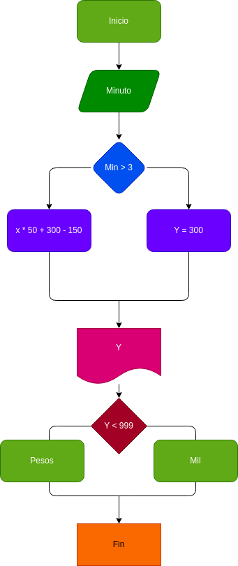

# llamada_telefonica
para calcular el costo de una llamada telefónica 

Ingresar el tiempo de duracion de una llamada telefónica y determinar la cantidad a pagar, deacuerdo a lo siguiente: 
- toda llamada que dure 3 minutos o menos tiene el coste de 300 pesos
- cada minuto adiccional cuesta 50 pesos
#Diagrama
